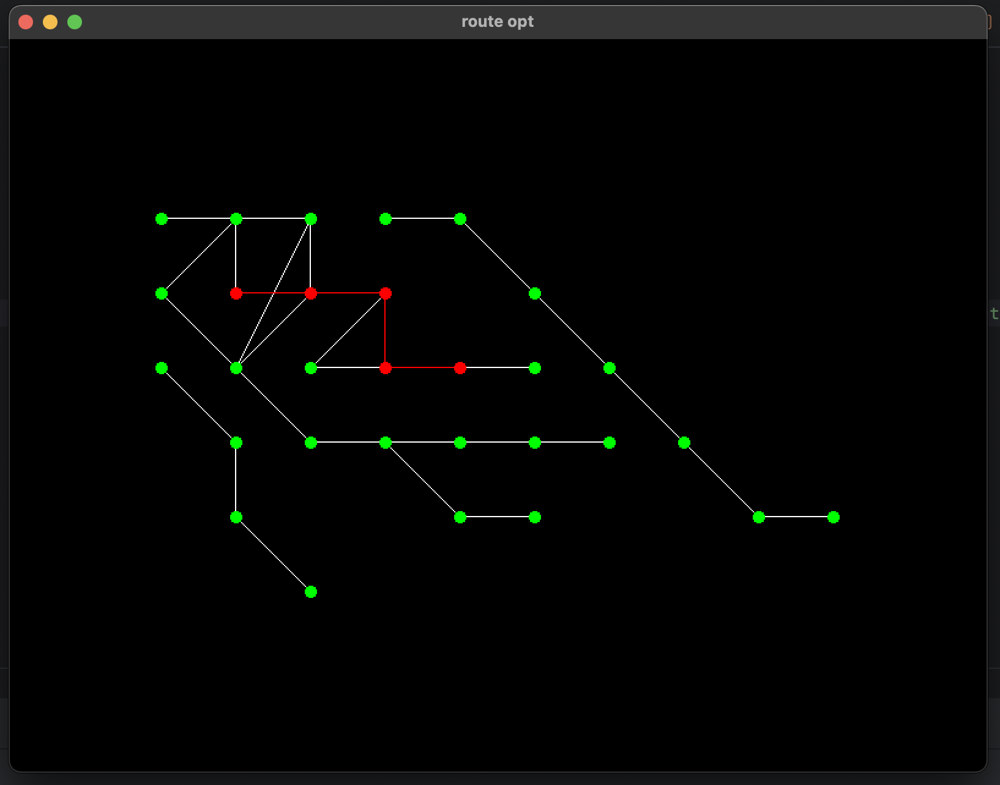

# route opt


Приложение для нахождения и визуализации кратчайшего пути между двумя точками на карте города. Приложение использует алгоритм Дейкстры и библиотеку SFML для отрисовки.



---

## Содержание
- [Возможности](#возможности)
- [Описание решения](#описание-решения)
- [Требования](#требования)
- [Установка и сборка](#установка-и-сборка)
- [Использование](#использование)
- [TODO](#todo)

---

## Возможности

- **Графическая визуализация:** Отображает граф как карту города с дорогами и перекрестками.
- **Вычисление кратчайшего пути:** Реализован алгоритм Дейкстры для оптимизации маршрута.
- **Интерактивный выбор:** Позволяет пользователям выбирать начальную и конечную точки визуально.
- **Динамическое масштабирование:** Адаптирует масштаб карты под размеры окна.

---

## Описание решения

В проекте реализован класс графа, который загружает данные из файла. При визуализации карты рассчитывается позиция каждой точки в окне, что позволяет адаптировать карту под размер окна приложения. Реализован механизм обработки действий пользователя: можно выбрать две точки на карте, после чего автоматически строится кратчайший маршрут между ними с использованием алгоритма Дейкстры. Структура проекта модульная, все компоненты подключаются в один файл `main.cpp`

---

## Требования

- **C++17 или новее**
- **SFML 2.6.0** или новее

---

## Установка и сборка

1. Клонируйте репозиторий:
```
git clone https://github.com/neklyudovv/route-opt.git
```

2. Соберите проект:
```
mkdir build
cd build
cmake ..
make
```

3. Запустите приложение:
```
./route_opt
```

---

## Использование

1. Подготовьте входные данные:
    - Формат: `<fromX> <fromY> <toX> <toY> <length> <traffic>`, где `length` - длина дороги, а `traffic` - загруженность
    - Пример:
```
0 0 10 0 10 3
10 0 20 0 10 2
10 10 20 10 10 1
20 10 30 10 10 2
```
2. Поместите входной файл в `data/input.txt`.
3. Запустите приложение.
4. Выберите две точки на карте для расчета кратчайшего пути между ними.

---

## TODO:

- [ ] Добавить поддержку подсказок при наведении мыши для отображения информации о точках.
- [ ] Внедрить выбор типа поиска пути (например, по минимальному расстоянию или минимальному трафику).
- [ ] Добавить загрузку графов в форматах JSON или XML.
- [ ] Написать тесты для всех основных функций.
